# Source Code Analysis Worker Template

> **Reference template — fork this directory.** This capability exists as a
> worked example of a worker-coordinated capability: multi-stage agent
> orchestration over a single event handler, structured findings via a
> typed capability tool, and validator fan-out. Read
> [`workers/coordinator.py`](workers/coordinator.py) top to bottom; the
> pipeline is intended to be readable end to end. It is not hardened for
> production use — the design and gaps are documented in "What's Not In
> Here" so consumers know what they need to add. See the public docs at
> [docs.dreadnode.io/capabilities/overview](https://docs.dreadnode.io/capabilities/overview/)
> for capability manifest conventions.

## What's A Worker?

**Workers** in Dreadnode are long-lived background components shipped with
a capability. They sit on the runtime, subscribe to events, and run
asynchronously alongside chat sessions. They're a general-purpose primitive
for anything you'd want to do server-side, in response to runtime
activity, that isn't itself a single chat turn.

The `Worker` class exposes a small set of decorators for common shapes:

- `@worker.on_event("kind")` — react to events on the runtime bus
  (turn lifecycle, session events, custom kinds your capability emits).
- `@worker.on_startup` / `@worker.on_shutdown` — open and close
  connections, seed state, flush queues.
- `@worker.every(seconds=...)` / `@worker.every(cron="...")` — run
  something on a schedule.
- `@worker.task` — supervise a long-running coroutine for the worker's
  lifetime, with restart-on-crash backoff.

What you do inside those handlers is up to you. Some examples:

- **Multi-agent orchestration** (this repo). One inbound request fans out
  across many agent sessions; the worker carries state and assembles
  results.
- **Bridges to external systems.** Forward `turn.completed` events to
  Slack/PagerDuty/a webhook; consume external callbacks and create
  matching agent sessions.
- **Cron-style jobs.** Sweep stale data, run periodic re-evaluations,
  rotate caches.
- **Stateful loops.** Tail an external queue; drive a long-running
  process; supervise an MCP transport.

Workers are how you put logic *next to the runtime* instead of in client
code, so it survives client disconnects and runs in the same process as
the agents and tools.

## What This Capability Demonstrates

This capability is one example of the multi-agent-orchestration shape: a
worker that subscribes to one event kind, runs a structured pipeline of
agent sessions, and publishes the assembled result back onto the bus.

A user publishes a single `source-analysis.requested` event with a GitHub
URL. The worker:

1. Clones the repo into a temp directory.
2. Runs eight agents across four stages — one mapper, five specialists in
   parallel, one final reviewer, then 0..N validators (one per recorded
   finding).
3. Streams progress and per-agent reports onto the runtime event bus as it
   goes.
4. Publishes a `source-analysis.completed` event with the assembled
   markdown report.

Each agent runs in its own headless session created by the worker. They
don't talk to each other; the worker carries state between them. Findings
flow from the final reviewer to the validators via a typed capability tool
(`record_finding`) — the worker reads the tool calls off the
`turn.completed` payload and spawns a validator per high/critical finding.

The complete pipeline is ~500 lines of Python in one file:

```mermaid
flowchart LR
    request["request<br/>GitHub URL"] --> worker["coordinator<br/>clone temp repo"]
    worker --> mapper["attack-surface mapper<br/>sources + sinks"]
    mapper --> specialists["5 specialists<br/>CVE, commit/test, common vulns,<br/>supply-chain/config, novel paths"]
    specialists --> final["final-reviewer<br/>reconcile + adversarial pass<br/>records findings"]
    final --> gate{"high / critical<br/>findings?"}
    gate -- "no" --> report["final report"]
    gate -- "yes" --> validators["0..N validators<br/>1 per finding"]
    validators --> report

    classDef event fill:#eef2ff,stroke:#4f46e5,color:#111827;
    classDef worker fill:#ecfeff,stroke:#0891b2,color:#111827;
    classDef agent fill:#f0fdf4,stroke:#16a34a,color:#111827;
    classDef finalPass fill:#fff7ed,stroke:#ea580c,color:#111827;
    classDef validator fill:#fdf2f8,stroke:#db2777,color:#111827;
    classDef decision fill:#fafafa,stroke:#6b7280,color:#111827;
    class request,report event;
    class worker worker;
    class mapper,specialists agent;
    class final finalPass;
    class validators validator;
    class gate decision;
```



## Run It

Against a remote runtime sandbox:

```bash
uv run --project packages/sdk python source-code-analysis-worker-template/scripts/analyze.py \
  https://github.com/markdown-it/markdown-it \
  --runtime-url "https://8787-<sandbox>.dev.sandbox.dreadnode.io" \
  --runtime-token "$SANDBOX_TOKEN" \
  --model "anthropic/claude-opus-4-5" \
  --output markdown-it-report.md
```

`--runtime-url` and `--runtime-token` fall back to `DREADNODE_RUNTIME_URL`
and `DREADNODE_RUNTIME_TOKEN`. Output streams to stdout while the worker
runs:

```text
Requested analysis run a4b3c2d1-…
Progress: clone_started — Cloning https://github.com/markdown-it/markdown-it
Progress: mapper_started
Report ready: attack-surface-mapper
Progress: specialists_started — Running 5 specialists
Report ready: cve-history-researcher
Report ready: supply-chain-config-reviewer
Report ready: common-vulnerability-hunter
Report ready: recent-commit-test-reviewer
Report ready: adversarial-pathfinder
Progress: final_review_started
Report ready: final-reviewer
Progress: validation_started — Validating 2 high/critical findings
Final report written to markdown-it-report.md
```

For developer-mode (no sandbox required), pass `--local`. The launcher boots
an in-process runtime that loads the capability straight from this directory:

```bash
uv run --project packages/sdk python source-code-analysis-worker-template/scripts/analyze.py \
  https://github.com/markdown-it/markdown-it \
  --local \
  --output markdown-it-report.md
```

For a sequential batch over many repos, put one GitHub URL per line in a
file and pass `--repo-file`:

```bash
uv run --project packages/sdk python source-code-analysis-worker-template/scripts/analyze.py \
  --repo-file repos.txt \
  --runtime-url "https://8787-<sandbox>.dev.sandbox.dreadnode.io" \
  --runtime-token "$SANDBOX_TOKEN" \
  --output-dir reports
```

If your terminal exits, resume watching an in-flight run by id without
re-submitting:

```bash
uv run --project packages/sdk python source-code-analysis-worker-template/scripts/analyze.py \
  --runtime-url "..." --runtime-token "..." \
  --run-id "<existing-run-id>" --watch-only \
  --output markdown-it-report.md
```

## The Agents

Eight markdown files in `agents/`. Each carries its full role, mission, tool
guidance, and output schema in the system prompt — the worker only sends
per-call dynamic context (URL, paths, prior reports). This keeps the worker
file tiny and lets agents evolve independently.

- **`attack-surface-mapper`**: maps entry points, attacker-controlled
  sources, dangerous sinks, trust boundaries, and high-value files to
  inspect.
- **`cve-history-researcher`**: looks for old vulnerability classes that
  might have new exploit paths in this repository.
- **`recent-commit-test-reviewer`**: reviews recent commits and test suites
  for regressions, missing coverage, and vulnerability clues.
- **`common-vulnerability-hunter`**: systematically checks common
  high-impact vulnerability classes in runtime code.
- **`supply-chain-config-reviewer`**: reviews dependency, build, release,
  deployment, and configuration risks.
- **`adversarial-pathfinder`**: focuses on novel, creative attack paths and
  surprising trust-boundary failures.
- **`final-reviewer`**: reconciles specialist evidence, performs an
  independent adversarial pass over the codebase, and records each high or
  critical finding by calling `record_finding` (see below).
- **`finding-validator`**: validates one finding, checks external context
  including the project's security process, and drafts bounded disclosure
  material for human review.

Agent frontmatter does not restrict tools, so each agent can use any
runtime tool (`bash`, `read`, `grep`, `glob`, `web_search`, `fetch`,
`think`, etc.) plus the capability-provided `record_finding` tool. The
prompts ask agents to prefer source reads, git commands, and targeted
searches — they do not run package managers, full builds, or full test
suites.

## Structured Findings Via Capability Tool

The `final-reviewer` agent doesn't return findings as JSON in markdown.
Instead, it calls a typed capability tool — once per high or critical
finding:

```python
# tools/findings.py
@tool
def record_finding(
    id: str,
    title: str,
    severity: Literal["critical", "high", "medium", "low", "informational"],
    confidence: Literal["high", "medium", "low"],
    claim: str,
    evidence: str,
    affected_files: list[str],
    attacker_capability: str,
    reachable_entrypoint: str,
    impact: str,
    exploit_prerequisites: str,
    deployment_assumptions: str,
    version_or_commit_scope: str,
    suggested_validation: str,
    origin: Literal["specialist-derived", "final-reviewer-new"],
    accepted_risk_notes: str = "",
) -> str:
    """Record one structured high or critical finding for validator review."""
    return f"Recorded {id} ({severity}): {title}"
```

The worker reads `tool_calls` off the `turn.completed` payload, filters for
`record_finding` invocations of high or critical severity, and spawns one
validator session per finding. This is more robust than parsing JSON out of
markdown — it's typed at the model boundary, the schema is in the agent's
prompt automatically, and partial failures don't lose findings.

One subtlety: capability tools are exposed to the model under a wire name
of the shape `<sanitized-capability>__<bare-name>`, so the extractor
matches both `record_finding` and `source_code_analysis_worker_template__record_finding`.
See [`_extract_findings`](workers/coordinator.py) for the matcher.

## Sessions, Labels, And The Trace UI

Each agent runs in its own runtime session created by the worker. The
worker labels every session it creates so a downstream UI or API can group
them:

- `source_analysis_run`: the run id (shared across every agent for one
  request).
- `github_url`: the repo being analyzed.
- `agent_role`: which agent (`attack-surface-mapper`, `cve-history-researcher`, etc.).
- `finding_id` (validators only): the specific finding being checked.

In the Dreadnode trace UI you can filter by any of these. Every agent's
work for one repo lands under one filter, every validator for one finding
lands under another. Validators carry both labels so you can drill from a
run, into a finding, into the agent that validated it.

Agents also call the built-in `report` tool with the same markdown they
return as their final answer, so each agent's output appears as a report
artifact in the trace UI without any worker-side wiring.

## Event Contract

The worker is bus-driven: it consumes one event kind and publishes four
others. All payloads carry a `run_id` that consumers filter on.

**Request** — published by the launcher to start a run:

```json
{
  "kind": "source-analysis.requested",
  "payload": {
    "run_id": "...",
    "github_url": "https://github.com/owner/repo",
    "model": "anthropic/claude-opus-4-5",
    "max_steps": 200
  }
}
```

**Stage progress** — emitted at each pipeline transition:

```json
{
  "kind": "source-analysis.progress",
  "payload": {
    "run_id": "...",
    "stage": "specialists_started",
    "detail": "Running 5 specialists"
  }
}
```

**Per-agent report** — streamed as each agent finishes:

```json
{
  "kind": "source-analysis.report.ready",
  "payload": {
    "run_id": "...",
    "agent": "cve-history-researcher",
    "report": "..."
  }
}
```

**Completion** — final assembled markdown:

```json
{
  "kind": "source-analysis.completed",
  "payload": {
    "run_id": "...",
    "github_url": "...",
    "final_report": "..."
  }
}
```

**Failure** — on uncaught exception:

```json
{
  "kind": "source-analysis.failed",
  "payload": {
    "run_id": "...",
    "github_url": "...",
    "error": "RuntimeError: git clone failed: ..."
  }
}
```

## Iterating On Capability Code

Capability code is bundled into the sandbox image at provision time, so a
local edit doesn't reach a running sandbox until the capability is
re-published *and* the sandbox is bounced. The dev loop is two steps:

```bash
# 1. Re-push the capability (overwrite the same version in your org registry)
uv run --project packages/sdk dn capability push \
  ./source-code-analysis-worker-template --force

# 2. Reset and start the runtime so the new sandbox bundles the latest code
uv run --project packages/sdk python source-code-analysis-worker-template/scripts/restart.py \
  <runtime-id> \
  --org dreadnode --workspace main
```

`scripts/restart.py` prints the new `sandbox_url` and `sandbox_token` from
the `start_runtime` response — paste those into the next `analyze.py`
invocation. Auth is the platform API key from your `dn login` profile.

If you'd rather bump versions instead of overwriting in place:

```bash
# Edit capability.yaml: version 0.1.0 → 0.1.1, then push without --force
uv run --project packages/sdk dn capability push \
  ./source-code-analysis-worker-template

# restart.py will update the runtime config to point at the new version
# before the bounce
uv run --project packages/sdk python source-code-analysis-worker-template/scripts/restart.py \
  <runtime-id> \
  --org dreadnode --workspace main \
  --bump-version 0.1.1 \
  --capability dreadnode/source-code-analysis-worker-template
```

For the fastest iteration loop while developing, pass `--local` to
`analyze.py`. That boots an in-process runtime that loads the capability
straight from this directory, so neither push nor restart is needed.

## Files

| Path | What |
|---|---|
| [`capability.yaml`](capability.yaml) | Declares the capability, agents, tools, worker, and a `git` check. |
| [`agents/*.md`](agents/) | Eight agent definitions. Each carries its full role, mission, tool guidance, and output schema in the system prompt. |
| [`tools/findings.py`](tools/findings.py) | The `record_finding` tool the final-reviewer calls per high/critical finding. |
| [`workers/coordinator.py`](workers/coordinator.py) | The single-file worker. Reads top-to-bottom as a tutorial example. |
| [`scripts/analyze.py`](scripts/analyze.py) | The launcher. Publishes the request event and watches progress. |
| [`scripts/restart.py`](scripts/restart.py) | Helper: reset and re-start the runtime sandbox after a `dn capability push`. |
| [`scripts/keepalive.py`](scripts/keepalive.py) | Helper: loops `keepalive_runtime` to extend a sandbox past its 1-hour expiry. |
| [`tests/`](tests/) | Unit tests for the coordinator's deterministic helpers (URL validation, tool-call extraction, prompt assembly, report assembly). Run with `uv run --extra dev pytest`. |

## What's Not In Here

This capability deliberately omits production-grade hardening so the
control flow stays readable. A real-world version would likely add:

- **Recovery turns** when an agent runs out of step budget mid-investigation.
- **`TurnFailedError` salvage** to recover the partial response when the
  runtime cuts an agent off.
- **Cancellation** via a `source-analysis.cancel` event handler.
- **Run-state persistence** so worker reload doesn't lose in-flight work.
- **Concurrent-run capping** with a queued event when slots are full.
- **Per-agent model overrides** (mapper vs. validator might want different
  models).
- **Tool-call dedup** when an agent calls `record_finding` twice for the
  same logical finding.
- **Disclosure email or webhook** on validated findings.

Each of these adds 30–100 lines and obscures the central pattern. The point
of the example is the central pattern; production layers on top.
